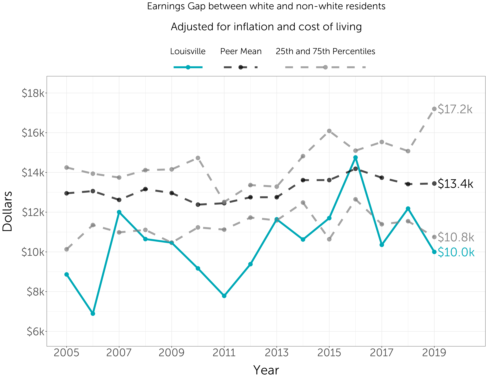
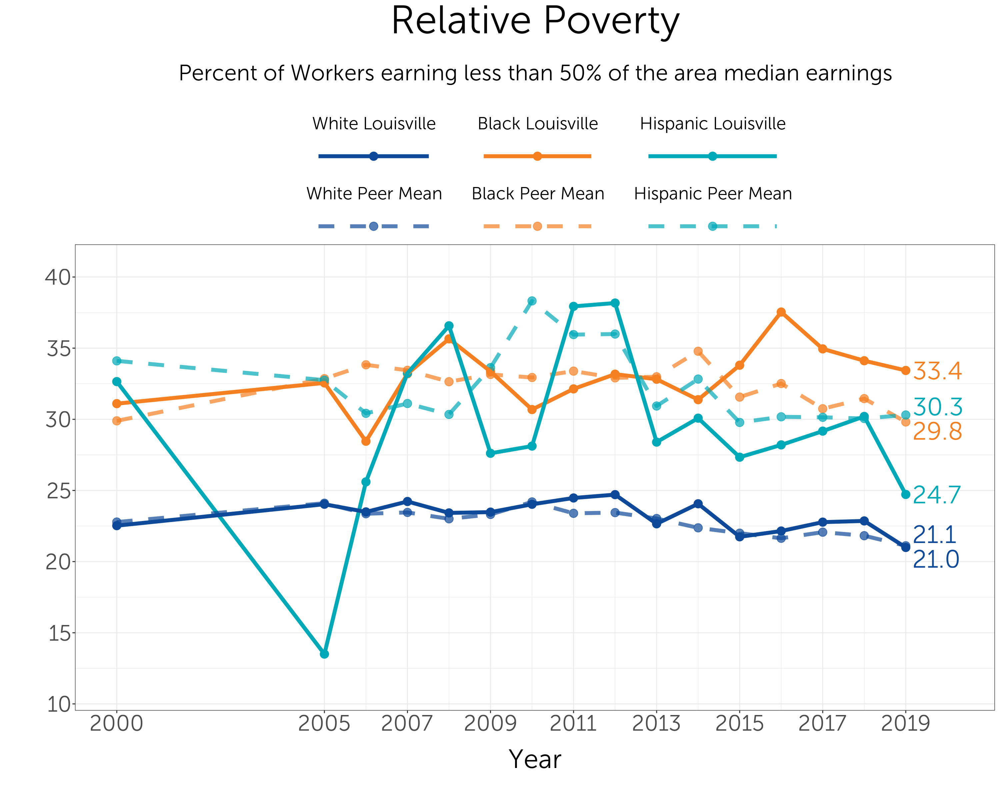
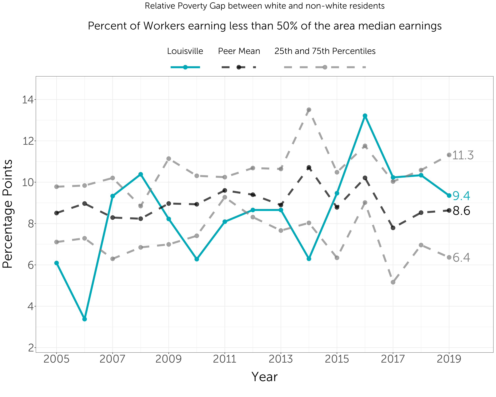
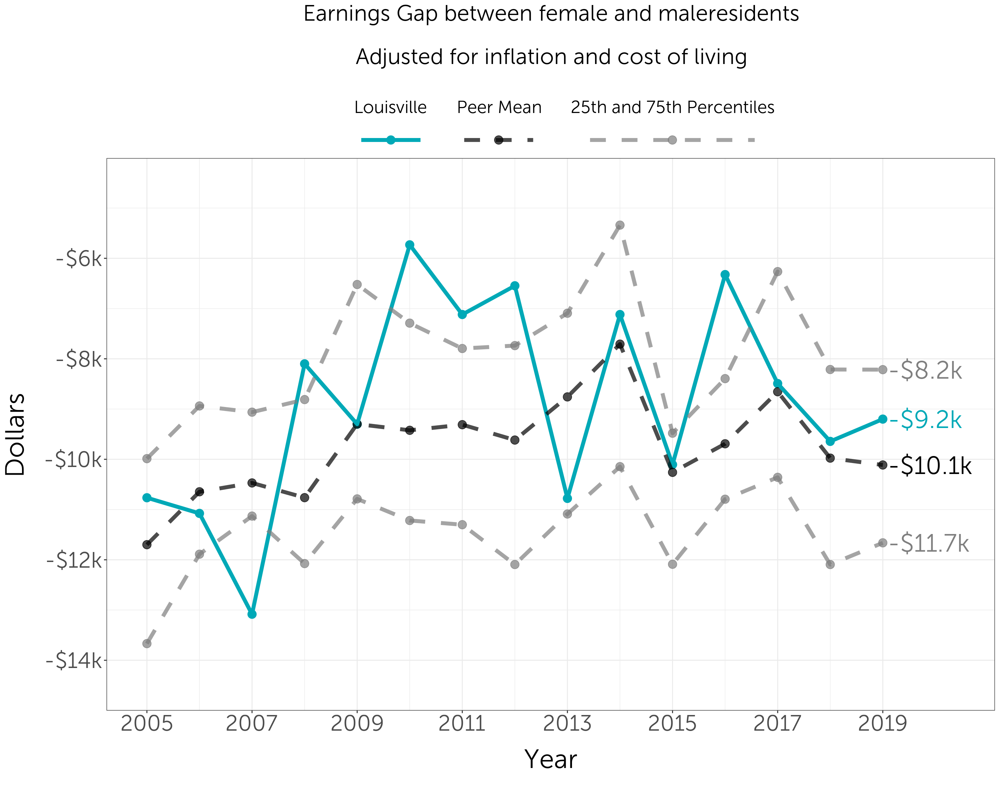

```{r setup, message=FALSE, warning=FALSE}
library(glptools)
library(tidycensus)
glp_load_packages(graphs = T)

showtext_auto()
font_add("Museo Sans", "MuseoSans_300.otf")
font_add("Museo Sans 300 Italic", "MuseoSans_300_Italic.otf")

knitr::opts_knit$set(root.dir = rprojroot::find_rstudio_root_file())

knitr::opts_chunk$set(echo = TRUE, warning = FALSE, message = FALSE, 
                      dev.args=list(bg="transparent"))
```

# Introduction

Main metro monitor image here...


```{r, eval=FALSE}

load("intermediate_data/output_data.RData")

justifyme <- function(x) {
  if (tolower(stringr::str_sub(x, 1, 1)) %in% c("l", "c", "r")) {
    whichletter <- tolower(stringr::str_sub(x, 1, 1))
    justification <- dplyr::case_when(
      whichletter == "l" ~ 0,
      whichletter == "c" ~ .5,
      whichletter == "r" ~ 1,
      TRUE ~ .5
    )
  } else if (x >= 0 && x <= 1) {
    justification <- x
  } else {
    justification <- 0.5
  }
  # return the changed plot
  return(justification)
}

newggslopegraph <- function (dataframe, Times, Measurement, Grouping, Data.label = NULL,
                             Title = "No title given", SubTitle = "No subtitle given",
                             Caption = "No caption given", XTextSize = 12, YTextSize = 3,
                             TitleTextSize = 14, SubTitleTextSize = 10, CaptionTextSize = 8,
                             TitleJustify = "left", SubTitleJustify = "left",
                             CaptionJustify = "right", LineThickness = 1, LineColor = "ByGroup",
                             DataTextSize = 2.5, DataTextColor = "black", DataLabelPadding = 0.05,
                             DataLabelLineSize = 0, DataLabelFillColor = "white",
                             WiderLabels = FALSE, ReverseYAxis = FALSE, ReverseXAxis = FALSE,
                             RemoveMissing = TRUE, ThemeChoice = "bw")
{
  if (ThemeChoice == "bw") {
    theme_set(theme_bw())
  }
  else if (ThemeChoice == "ipsum") {
    theme_set(hrbrthemes::theme_ipsum_rc())
  }
  else if (ThemeChoice == "econ") {
    theme_set(ggthemes::theme_economist())
    if (DataLabelFillColor == "white") {
      DataLabelFillColor <- "#d5e4eb"
    }
  }
  else if (ThemeChoice == "wsj") {
    theme_set(ggthemes::theme_wsj())
    if (DataLabelFillColor == "white") {
      DataLabelFillColor <- "#f8f2e4"
    }
    TitleTextSize <- TitleTextSize - 1
    SubTitleTextSize <- SubTitleTextSize + 1
  }
  else if (ThemeChoice == "gdocs") {
    theme_set(ggthemes::theme_gdocs())
  }
  else if (ThemeChoice == "tufte") {
    theme_set(ggthemes::theme_tufte())
  }
  else {
    theme_set(theme_bw())
  }
  MySpecial <- list(scale_x_discrete(position = "top"),
                    theme(text = element_text(family = "sans")),
                    theme(legend.position = "none"), theme(panel.border = element_blank()),
                    theme(axis.title.y = element_blank()), theme(axis.text.y = element_blank()),
                    theme(panel.grid.major.y = element_blank()), theme(panel.grid.minor.y = element_blank()),
                    theme(axis.title.x = element_blank()), theme(panel.grid.major.x = element_blank()),
                    theme(axis.text.x.top = element_text(size = XTextSize,
                                                         face = "bold")), theme(axis.ticks = element_blank()),
                    theme(plot.title = element_text(size = TitleTextSize,
                                                    face = "bold", hjust = justifyme(TitleJustify))),
                    theme(plot.subtitle = element_text(size = SubTitleTextSize,
                                                       hjust = justifyme(SubTitleJustify))),
                    theme(plot.caption = element_text(size = CaptionTextSize,
                                                      hjust = justifyme(CaptionJustify))))
  if (length(match.call()) <= 4) {
    stop("Not enough arguments passed requires a dataframe, plus at least three variables")
  }
  argList <- as.list(match.call()[-1])
  if (!hasArg(dataframe)) {
    stop("You didn't specify a dataframe to use", call. = FALSE)
  }
  NTimes <- deparse(substitute(Times))
  NMeasurement <- deparse(substitute(Measurement))
  NGrouping <- deparse(substitute(Grouping))
  if (is.null(argList$Data.label)) {
    NData.label <- deparse(substitute(Measurement))
    Data.label <- argList$Measurement
  }
  else {
    NData.label <- deparse(substitute(Data.label))
  }
  Ndataframe <- argList$dataframe
  if (!is(dataframe, "data.frame")) {
    stop(paste0("'", Ndataframe, "' does not appear to be a data frame"))
  }
  if (!NTimes %in% names(dataframe)) {
    stop(paste0("'", NTimes, "' is not the name of a variable in the dataframe"),
         call. = FALSE)
  }
  if (anyNA(dataframe[[NTimes]])) {
    stop(paste0("'", NTimes, "' can not have missing data please remove those rows!"),
         call. = FALSE)
  }
  if (!NMeasurement %in% names(dataframe)) {
    stop(paste0("'", NMeasurement, "' is not the name of a variable in the dataframe"),
         call. = FALSE)
  }
  if (!NGrouping %in% names(dataframe)) {
    stop(paste0("'", NGrouping, "' is not the name of a variable in the dataframe"),
         call. = FALSE)
  }
  if (!NData.label %in% names(dataframe)) {
    stop(paste0("'", NData.label, "' is not the name of a variable in the dataframe"),
         call. = FALSE)
  }
  if (anyNA(dataframe[[NGrouping]])) {
    stop(paste0("'", NGrouping, "' can not have missing data please remove those rows!"),
         call. = FALSE)
  }
  if (!class(dataframe[[NMeasurement]]) %in% c("integer",
                                               "numeric")) {
    stop(paste0("Sorry I need the measured variable '",
                NMeasurement, "' to be a number"), call. = FALSE)
  }
  if (!"ordered" %in% class(dataframe[[NTimes]])) {
    if (!"character" %in% class(dataframe[[NTimes]])) {
      if ("factor" %in% class(dataframe[[NTimes]])) {
        message(paste0("\nConverting '", NTimes,
                       "' to an ordered factor\n"))
        dataframe[[NTimes]] <- factor(dataframe[[NTimes]],
                                      ordered = TRUE)
      }
      else {
        stop(paste0("Sorry I need the variable '",
                    NTimes, "' to be of class character, factor or ordered"),
             call. = FALSE)
      }
    }
  }
  Times <- enquo(Times)
  Measurement <- enquo(Measurement)
  Grouping <- enquo(Grouping)
  Data.label <- enquo(Data.label)
  if (ReverseXAxis) {
    dataframe[[NTimes]] <- forcats::fct_rev(dataframe[[NTimes]])
  }
  NumbOfLevels <- nlevels(factor(dataframe[[NTimes]]))
  if (WiderLabels) {
    MySpecial <- c(MySpecial, expand_limits(x = c(-1, NumbOfLevels +
                                                    2)))
  }
  if (ReverseYAxis) {
    MySpecial <- c(MySpecial, scale_y_reverse())
  }
  if (length(LineColor) > 1) {
    if (length(LineColor) < length(unique(dataframe[[NGrouping]]))) {
      message(paste0("\nYou gave me ", length(LineColor),
                     " colors I'm recycling colors because you have ",
                     length(unique(dataframe[[NGrouping]])), " ",
                     NGrouping, "s\n"))
      LineColor <- rep(LineColor, length.out = length(unique(dataframe[[NGrouping]])))
    }
    LineGeom <- list(geom_line(aes_(color = Grouping), size = LineThickness),
                     scale_color_manual(values = LineColor))
  }
  else {
    if (LineColor == "ByGroup") {
      LineGeom <- list(geom_line(aes_(color = Grouping,
                                      alpha = 1), size = LineThickness))
    }
    else {
      LineGeom <- list(geom_line(aes_(), size = LineThickness,
                                 color = LineColor))
    }
  }
  if (anyNA(dataframe[[NMeasurement]])) {
    if (RemoveMissing) {
      dataframe <- dataframe %>% group_by(!!Grouping) %>%
        filter(!anyNA(!!Measurement)) %>% droplevels()
    }
    else {
      dataframe <- dataframe %>% filter(!is.na(!!Measurement))
    }
  }
  dataframe %>%
    ggplot(aes_(group = Grouping,
                y = Measurement,
                x = Times)) +
    LineGeom +
    geom_text_repel(data = . %>%
                      filter(!!Times == min(!!Times)), aes_(label = Grouping),
                      hjust = "left", box.padding = 0.1, point.padding = 0.1,
                      segment.color = "gray", segment.alpha = 0.6, fontface = "bold",
                      size = YTextSize, nudge_x = -1.95, direction = "y",
                      force = 0.5, max.iter = 3000) +
    geom_text_repel(data = . %>%
                      filter(!!Times == max(!!Times)), aes_(label = Grouping),
                      hjust = "right", box.padding = 0.1, point.padding = 0.1,
                      segment.color = "gray", segment.alpha = 0.6, fontface = "bold",
                      size = YTextSize, nudge_x = 1.95, direction = "y",
                      force = 0.5, max.iter = 3000) + geom_label(aes_string(label = NData.label),
                      size = DataTextSize, label.padding = unit(DataLabelPadding,
                      "lines"), label.size = DataLabelLineSize, color = DataTextColor,
                      fill = DataLabelFillColor) + MySpecial + labs(title = Title,
                      subtitle = SubTitle, caption = Caption)
}

```

```{r, eval=FALSE}

ranking_df <- change_df %>%
  filter(variable %in% c("growth_index", "prosperity_index", "overall_inclusion", "racial_inclusion", "gender_inclusion", "geographic_inclusion")) %>%
  mutate(year = as.character(year))

#temp %<>% mutate(label = round(assoc_plus, 1))

color_vector = unique(ranking_df$city)

custom_colors <- ranking_df %>%
  filter(year == "2019", variable == "growth_index") %>%
  mutate(color = if_else(city == "Louisville", "#75A1C7", "gray90")) %>%
  select(city, color) %>%
  tibble::deframe()


variables <- c("growth_index","prosperity_index", "overall_inclusion", "racial_inclusion", "gender_inclusion", "geographic_inclusion")
names <- c("Growth","Prosperity", "Overall Inclusion", "Racial Inclusion", "Gender Inclusion", "Geographic Inclusion")


for(i in 1:6){

  
  name = "images/" %p% names[i] %p% "_growth.png"
  
  custom_colors <- ranking_df %>%
    filter(year == "2019", variable == variables[i]) %>%
    mutate(color = if_else(city == "Louisville", "#75A1C7", "gray90")) %>%
    select(city, color) %>%
    tibble::deframe()
    
  png(name, height = 600, width = 900)
  newggslopegraph(dataframe = filter(ranking_df, variable == variables[i]),
                  Times = year,
                  Measurement = ranking,
                  Grouping = city,
                  ReverseYAxis = TRUE,
                  LineColor = custom_colors,
                  Title = names[i],
                  SubTitle = NULL,
                  Caption  = NULL,
                  WiderLabels = T,
                  DataLabelPadding = 0.25,
                  DataTextSize = 3.5)
  dev.off()
}


```

# Growth

*Growth* indicators measure change in the size of a metropolitan area economy and the economy’s level of entrepreneurial activity. Growth creates new opportunities for individuals and can help a metropolitan economy become more efficient. Entrepreneurship plays a critical role in growth, creating new jobs and new output; entrepreneurial activity can also indicate investors’ confidence in future growth and prosperity.

These measures are not adjusted for population. The per capita data are included in the prosperity section.

## Output

*Output, or Gross Domestic Product (GDP)* measures the total value of goods and services produced in a metropolitan area, including wages and profits.

After adjusting for inflation, Louisville's GDP increased by around $12 billion from 2002 to 2019, falling slightly further behind the peer average. Because this data is not adjusted for population, our GDP is largely a reflection of our city's size. Our GDP per capita is included in the Standard of Living section.

The Metro Monitor ranks cities on their percent change in GDP.

```{r gdp, cache=TRUE}
gdp <- readxl::read_excel("raw_data/GeoFRED_Gross_Domestic_Product__All_Industries_by_County_Thousands_of_U.S._Dollars.xls", skip = 1)

gdp %<>%
  pivot_longer(`2001`:`2020`, names_to = "year", values_to = "GDP") %>%
  transmute(
    FIPS = `Region Code`,
    year = as.numeric(year),
    GDP = GDP *1000)

COLA_df <- glptools::COLA_df %>%
  select(year, cpi) %>%
  distinct() %>%
  mutate(base_cpi = cpi[year == 2020],
         cpi_index = base_cpi/cpi) %>%
  select(year, cpi_index)

gdp2 <- gdp %>%
  pull_peers(geog = "MSA") %>%
  left_join(MSA_FIPS, by = "FIPS") %>%
  mutate(core_c = if_else(FIPS %in% FIPS_df_two_stl$FIPS, "core", "suburb")) %>%
  group_by(MSA, year, core_c) %>%
  summarize(GDP = sum(GDP), .groups = "drop") %>%
  pivot_wider(names_from = core_c, values_from = GDP)

gdp2 %<>%
  filter(year %in% c(2009, 2019)) %>%
  left_join(COLA_df, by = "year") %>%
  mutate(core = core * cpi_index,
         suburb = suburb * cpi_index) %>%
  group_by(MSA) %>%
  summarize(core = core[year == 2019] - core[year == 2009],
            suburb = suburb[year == 2019] - suburb[year == 2009]) %>%
  mutate(percent_suburb = suburb / (suburb + core) * 100) %>%
  left_join(MSA_FIPS_core_county, by = "MSA") %>%
  pull_peers(add_info = T) %>%
  select(city, core, suburb, percent_suburb)

write_csv(gdp2, "gdp_change.csv")

rm(COLA_df)

gdp %<>%
  pull_peers() %>%
  stl_merge(GDP, method = "sum", simple = T) %>%
  COLA(GDP, base_year = 2020, rpp = F)

metro_monitor <- gdp
```

```{r, eval=FALSE, include=FALSE}
plot1 <- ranking(
  gdp,
  GDP,
  plot_title = "Gross Domestic Product, 2019",
  y_title = "Dollars",
  label_function = dollar_format(scale = 0.000000001, suffix = "B"))

plot3 <- trend(
  gdp,
  GDP,
  plot_title = "Gross Domestic Product",
  y_title = "Dollars",
  label_function = dollar_format(scale = 0.000000001, suffix = "B"),
  axis_function = dollar_format(scale = 0.000000001, suffix = "B", accuracy = 1))

gdp_trend <- trend_data(gdp, GDP)

metro_change <- function(df, var, city) {
  temp <- df %>%
    filter(year %in% c(2009, 2019), variable == city)
  
  (temp[2, var] - temp[1,var]) / temp[1,var] * 100
}

t=
t=metro_change(gdp_trend, "GDP", "mean")

gdp_trend %<>%
  filter(year %in% c(2009, 2019), variable %in% c("lou", "mean")) %>%
  group_by(variable) %>%
  mutate(growth = (GDP[year == 2019] - GDP[year == 2009]) / GDP[year == 2009]) %>%
  ungroup()

gdp_wide <- gdp_trend %>%
  pivot_wider(values_from =GDP, names_from = year)

plot4 <- ggplot(gdp_trend, aes(x = variable, y = GDP)) +
  geom_segment(data = gdp_wide, aes(x=variable, xend=variable, y=`2009`, yend=`2019`, color = variable), size = 2) +
  geom_point(
    aes(color = variable,
        size = 1.8)) + 
  scale_color_manual(values = c("#00a9b7", "black"),
                     labels = c("lou", "mean")) +
  theme(
    legend.position = "none",
    axis.text    = element_blank(),
    axis.title = element_blank(),
    axis.ticks = element_blank()) +
    theme(
      panel.background = element_rect(fill = "transparent", color = NA), # bg of the panel
      plot.background = element_rect(fill = "transparent", color = NA)) # bg of the plot)

  
plot2 <- ggplot() + 
  annotate("text",
           x = 1,
           y = 1,
           size = 8,
           label = "Textplanation") + 
  theme_void()

# area(top, left, bottom, right)

design <- c(
  area(1, 1, 2, 3),
  area(1, 3, 2, 4),
  area(3, 1, 3, 3),
  area(3, 4, 3, 4))

png("images/employment_test.png", 3000, 2400, res = 200, bg = "transparent", type = "cairo")
plot1 + plot2 + plot3 + plot4 +  plot_layout(design = design)
invisible(dev.off())

```

```{r}
png("images/gdp_trend.png", 3000, 2400, res = 200, bg = "transparent", type = "cairo")
trend(
  gdp,
  GDP,
  plot_title = "Gross Domestic Product",
  y_title = "Dollars",
  label_function = dollar_format(scale = 0.000000001, suffix = "B"),
  axis_function = dollar_format(scale = 0.000000001, suffix = "B", accuracy = 1))
invisible(dev.off())
```

Louisville's gross domestic product 


## Jobs

*Jobs* measure the total number of occupied full- and part-time wage and salaried employment positions in a metropolitan economy.

The number of jobs in Louisville increased at a similar rate to peer cities from 2005 to 2020. Louisville added around 126,000 jobs from the low of 2010 to a high in 2019. The number of jobs decreased by 48,000 in 2020 due to the pandemic.

Because this data is not adjusted for population, the nunber of jobs is largely a reflection of our city's size.

```{r jobs}

if ("jobs.RData" %in% list.files("intermediate_data")) {
  load("intermediate_data/jobs.RData")
} else {

library(censusapi)

# Create data frame of variables
var_df <- crossing(FIPS = unique(FIPS_df_two_stl$FIPS),
                   year = 2005:2020,
                   name = "timeseries/qwi/sa", #c("timeseries/qwi/sa", "timeseries/qwi/se", "timeseries/qwi/rh"),
                   industry_code = "00")

# function wrapper to get data
get_fxn <- function(data) {
  getCensus(
    name = data$name,
    vars = c("Emp", "EmpEnd", "EarnBeg"), 
    region = "county:" %p% str_sub(data$FIPS, 3, 5),
    regionin = "state:" %p% str_sub(data$FIPS, 1, 2),
    time = data$year,
    key = "52e7948461b29e2ed1f7c53ceee270e6f7d8bcfe") %>%
  nest(results = everything())
}

# Get data
future::plan(future::multisession)

all_jobs = var_df %>%
  group_by(row_number()) %>%
  nest() %>%
  mutate(results = furrr::future_map_dfr(data, get_fxn)) %>%
  select(-data) %>%
  unnest(results) %>%
  unnest(results) %>%
  ungroup()

# repeat process for jobs at young firms
var_df %<>% crossing(age = c(1, 2, 3))

get_fxn <- function(data) {
  getCensus(
    name = data$name,
    vars = c("Emp", "EmpEnd", "EarnBeg"), 
    region = "county:" %p% str_sub(data$FIPS, 3, 5),
    regionin = "state:" %p% str_sub(data$FIPS, 1, 2),
    time = data$year,
    ownercode = "A05",
    firmage = data$age,
    key = "52e7948461b29e2ed1f7c53ceee270e6f7d8bcfe") %>%
  nest(results = everything())
}

young_jobs = var_df %>%
  group_by(row_number()) %>%
  nest() %>%
  mutate(results = furrr::future_map_dfr(data, get_fxn)) %>%
  select(-data) %>%
  unnest(results) %>%
  unnest(results) %>%
  ungroup()

clean_fxn <- function(df) {
  df %>%
    mutate(
      FIPS = state %p% county,
      year = as.numeric(str_sub(time, 1, 4)),
      Emp = as.numeric(Emp),
      EmpEnd = as.numeric(EmpEnd),
      EarnBeg = as.numeric(EarnBeg),
      Qemp = Emp + EmpEnd,
      wages = EarnBeg * 12) %>%
    group_by(FIPS, year) %>%
    summarize(
      jobs = mean(Qemp), 
      wages = mean(wages),
      .groups = "drop")
}

all_jobs %<>%
  clean_fxn()

jobs <- all_jobs %>%
  stl_merge(jobs, method = "sum", simple = T)

wages <- all_jobs %>%
  stl_merge(wages, method = "mean", simple = T) %>%
  COLA(wages, rpp = F)

young_jobs %<>%
  clean_fxn() %>%
  stl_merge(jobs, method = "sum", simple = T) %>%
  select(
    FIPS, year,
    young_jobs = jobs)

save(jobs, wages, young_jobs, file= "intermediate_data/jobs.RData")

}
  
metro_monitor %<>%
  left_join(jobs, by = c("FIPS", "year")) %>%
  left_join(young_jobs, by = c("FIPS", "year")) %>%
  left_join(wages, by = c("FIPS", "year"))

```


```{r}
png("images/jobs_trend.png", 3000, 2400, res = 200, bg = "transparent", type = "cairo")
trend(
  metro_monitor,
  jobs,
  plot_title = "Jobs",
  y_title = "None")
invisible(dev.off())
```


## Jobs at young firms

*Jobs at young firms* captures the total number of full- and part-time wage and salaried jobs at young, private-sector firms age five years. It reflects the employment impact of entrepreneurship in a metropolitan area.


```{r}
png("images/young_jobs_trend.png", 3000, 2400, res = 200, bg = "transparent", type = "cairo")
trend(
  metro_monitor,
  young_jobs,
  plot_title = "Jobs at young firms",
  subtitle_text = "Firms younger than 5 years",
  y_title = "None")
invisible(dev.off())
```


# Prosperity

*Prosperity* indicators capture changes in the average wealth and income produced by an economy. When a metropolitan area grows by increasing the productivity of its workers, through innovation or by upgrading workers’ skills, for example, the value of those workers’ labor rises. As the value of labor rises, so can wages. Increases in productivity and wages are what ultimately improve living standards for workers and families.

## Average Annual Wage {.tabset}

*Average annual wage* equals aggregate annual wages paid to workers divided by the total number of jobs.

### Ranking

```{r}
png("images/average_wage_ranking.png", 3000, 2400, res = 200, bg = "transparent", type = "cairo")
ranking(
  metro_monitor,
  wages,
  year = 2019,
  plot_title = "Average Annual Wages, 2019",
  y_title = "Dollars")
invisible(dev.off())
```


### Trend

```{r}
png("images/average_wage_trend.png", 3000, 2400, res = 200, bg = "transparent", type = "cairo")
trend(
  metro_monitor,
  wages,
  plot_title = "Average Annual Wages",
  y_title = "Dollars")
invisible(dev.off())
```


## Productivity {.tabset}

*Productivity* equals Gross Domestic Product divided by the total number of jobs, a crude measure of a metropolitan economy’s overall productivity.

```{r}
metro_monitor %<>%
  mutate(productivity = GDP / jobs)
```

### Ranking

```{r}
png("images/productivity_ranking.png", 3000, 2400, res = 200, bg = "transparent", type = "cairo")
ranking(
  metro_monitor,
  productivity,
  year = 2019,
  plot_title = "Productivity, 2019",
  subtitle_text = "GDP per job",
  y_title = "Dollars")
invisible(dev.off())
```


### Trend

```{r}
png("images/productivity_trend.png", 3000, 2400, res = 200, bg = "transparent", type = "cairo")
trend(
  metro_monitor,
  productivity,
  plot_title = "Productivity",
  subtitle_text = "GDP per job",
  y_title = "Dollars")
invisible(dev.off())
```


## Standard of Living {.tabset}

*Standard of living* equals Gross Metropolitan Product divided by total metropolitan population (GMP per capita), which reflects a metropolitan economy’s average standard of living.

```{r}
pop_df <- glpdata::population_county %>%
  filter(race == "total", sex == "total") %>%
  select(FIPS, year, population) %>%
  complete(FIPS, year = 2000:2020) %>%
  fill(population, .direction = "down")

standard_of_living <- left_join(gdp, pop_df, by = c("FIPS", "year"))

standard_of_living %<>%
  mutate(standard_of_living = GDP / population) %>%
  select(-population, -GDP)

metro_monitor %<>%
  left_join(standard_of_living, by = c("FIPS", "year"))
```

### Ranking

```{r}
png("images/standard_of_living_ranking.png", 3000, 2400, res = 200, bg = "transparent", type = "cairo")
ranking(
  metro_monitor,
  standard_of_living,
  year = 2019,
  plot_title = "Standard of Living, 2019",
  subtitle_text = "GDP per person",
  y_title = "Dollars")
invisible(dev.off())
```


### Trend

```{r}
png("images/standard_of_living_trend.png", 3000, 2400, res = 200, bg = "transparent", type = "cairo")
trend(
  metro_monitor,
  standard_of_living,
  plot_title = "Standard of Living",
  subtitle_text = "GDP per person",
  y_title = "Dollars")
invisible(dev.off())
```


# Overall Inclusion

*Inclusion* indicators measure how the benefits of growth and prosperity in a metropolitan economy—specifically, changes in employment and income—are distributed among individuals. Inclusive growth enables more people to invest in their skills and to purchase more goods and services. Thus, inclusive growth can increase human capital and raise aggregate demand, boosting prosperity and growth.)

## Employment Rate {.tabset}

*Employment rate* measures the share of individuals ages 18 to 64 who are currently employed.

```{r employment_gap}
if ("employment.RData" %in% list.files("intermediate_data")) {
  load("intermediate_data/employment.RData")
} else {

# Load data

unemployment_vars_00 <- build_census_var_df("sf3", c("PCT35", "P150"))
unemployment_vars_05_1yr <- build_census_var_df("acs1", c("B23001", "B23002"))
unemployment_vars_05_5yr <- build_census_var_df("acs5", "B23001")

unemployment_05_1yr <- bind_rows(unemployment_vars_00, unemployment_vars_05_1yr)
unemployment_05_5yr <- bind_rows(unemployment_vars_00, unemployment_vars_05_5yr)

unemployment_05_1yr <- bind_rows(unemployment_vars_00, unemployment_vars_05_1yr)
unemployment_05_5yr <- bind_rows(unemployment_vars_00, unemployment_vars_05_5yr)

unemployment_county    <- get_census(unemployment_05_1yr, "FIPS", parallel = T)
unemployment_map_all    <- get_census(unemployment_05_5yr, "tract_all", parallel = T)

test1 <- unemployment_county
test2 <- unemployment_map_all

# Categorize employment variables
unemployment_county %<>%
  mutate(
    employed = case_when(
      str_detect(label, "Employed|Armed Forces") ~ TRUE,
      str_detect(label, "Unemployed") ~ FALSE,
      str_detect(label, "ot in labor force") ~ FALSE,
      str_detect(label, "Total") ~ NA))

unemployment_map_all %<>%
  mutate(
    employed = case_when(
      str_detect(label, "Employed|Armed Forces") ~ TRUE,
      str_detect(label, "Unemployed") ~ FALSE,
      str_detect(label, "ot in labor force") ~ FALSE,
      str_detect(label, "Total") ~ NA))

# Categories check out
#test <- unemployment_map_all2 %>% filter(tract == "01073012602", var_type == "estimate", year == 2017, sex == "male")

unemployment_county %<>% process_census(var_names = "value", cat_var = "employed", output_name = "employment", age_groups = "18_64")
unemployment_map_all %<>% process_census(var_names = "value", cat_var = "employed", output_name = "employment", age_groups = "18_64")

save(unemployment_county, unemployment_map_all, file= "intermediate_data/employment.RData")
}

unemployment_county_small <- unemployment_county %>%
  filter(sex == "total", race == "total", var_type == "percent") %>%
  select(FIPS, year, employment)

metro_monitor %<>%
  left_join(unemployment_county_small, by = c("FIPS", "year"))

test = unemployment_county %>%filter(FIPS == "21111", year %in% c(2009, 2019), sex == "total")

```

### Ranking

```{r}
png("images/employment_ranking.png", 3000, 2400, res = 200, bg = "transparent", type = "cairo")
ranking(
  metro_monitor,
  employment,
  plot_title = "Employment, 2019",
  subtitle_text = "Percent of adults age 18-64 who are employed")
invisible(dev.off())
```


### Trend

```{r}
png("images/employment_trend.png", 3000, 2400, res = 200, bg = "transparent", type = "cairo")
trend(
  metro_monitor,
  employment,
  plot_title = "Employment",
  subtitle_text = "Percent of adults age 18-64 who are employed")
invisible(dev.off())
```


## Median Earnings {.tabset}

*Median earnings* measures the annual wage earned by the person in the middle of a metropolitan area’s income distribution (among people at least 16 years old).

```{r}
# earnings <- glpdata::earnings_county
# 
# earnings %<>%
#   filter(sex == "total", race == "total", var_type == "estimate") %>%
#   select(FIPS, year, median_earnings) %>%
#   unique()

microdata <- arrow::read_feather("../../glpdata/data-raw/microdata/acs_micro_repwts.feather")

microdata %<>%
  filter(age >= 16,
         INCEARN > 0)

earnings <- survey_by_demog(microdata, "INCEARN", "PERWT", type = "median", 
                            breakdowns = c("total", "sex", "race"))

earnings_county <- earnings %>%
  filter(var_type == "estimate", sex == "total", race == "total") %>%
  COLA(INCEARN, base_year = 2019) %>%
  select(FIPS, year, median_earnings = INCEARN)

metro_monitor %<>% left_join(earnings_county, by = c("FIPS", "year"))

```

### Ranking

```{r}
png("images/earnings_ranking.png", 3000, 2400, res = 200, bg = "transparent", type = "cairo")
ranking(
  metro_monitor,
  median_earnings,
  y_title = "Dollars",
  plot_title = "Median Earnings, 2019",
  subtitle_text = "Adjusted for inflation and cost of living")
invisible(dev.off())
```


### Trend

```{r}
png("images/earnings_trend.png", 3000, 2400, res = 200, bg = "transparent", type = "cairo")
trend(
  metro_monitor,
  median_earnings,
  plot_title = "Median Earnings",
  subtitle_text = "Adjusted for inflation and cost of living")
invisible(dev.off())
```


## Relative Poverty Rate {.tabset}

*Relative earnings poverty* measures the share of people earning less than half of the local median wage (among people at least 16 years old).

```{r}

earnings_cutoffs <- earnings %>%
  filter(var_type == "estimate", sex == "total", race == "total") %>%
  mutate(relative_pov_rate = INCEARN / 2) %>%
  select(FIPS, year, relative_pov_rate)

microdata %<>%
  left_join(earnings_cutoffs, by = c("FIPS", "year")) %>%
  mutate(relative_poverty = if_else(INCEARN < relative_pov_rate, T, F))

relative_earnings_poverty <- survey_by_demog(microdata, "relative_poverty", "PERWT", type = "categorical", 
                                             breakdowns = c("total", "sex", "race"))

relative_earnings_poverty_county <- relative_earnings_poverty %>%
  filter(sex == "total", race == "total", var_type == "percent") %>%
  select(FIPS, year, relative_poverty)

metro_monitor %<>%
  left_join(relative_earnings_poverty_county, by = c("FIPS", "year"))
```

### Ranking

```{r}
png("images/relative_poverty_ranking.png", 3000, 2400, res = 200, bg = "transparent", type = "cairo")
ranking(
  metro_monitor,
  relative_poverty,
  order = "Ascending",
  plot_title = "Relative Poverty, 2019",
  subtitle_text = "Percent of Workers earning less than 50% of the area median earnings")
invisible(dev.off())
```


### Trend

```{r}
png("images/relative_poverty_trend.png", 3000, 2400, res = 200, bg = "transparent", type = "cairo")
trend(
  metro_monitor,
  relative_poverty,
  plot_title = "Relative Poverty",
  rollmean = 1,
  subtitle_text = "Percent of Workers earning less than 50% of the area median earnings")
invisible(dev.off())
```


# Racial Inclusion

*Racial inclusion* indicators measure the gap between the non-Hispanic white population and people of color on indicators of inclusion: median income, employment rate, and relative income poverty.

## Racial Gap in employment rate {.tabset}

*Employment rate* measures the share of individuals ages 18 to 64 who are currently employed.

```{r}
# unemployment_race <- unemployment_county %>%
#   group_by(race) %>%
#   filter(var_type == "CI") %>%
#   summarize(avg_CI = mean(employment, na.rm=T))
  
unemployment_race <- unemployment_county %>%
  filter(var_type == "percent",
         sex == "total",
         race %in% c("white", "black"))

unemployment_race_gap <- unemployment_county %>%
  filter(race %in% c("white", "total"), sex == "total", var_type %in% c("estimate", "population")) %>%
  pivot_wider(names_from = race, values_from = employment) %>%
  mutate(nonwhite = total - white) %>%
  pivot_vartype_wider(total:nonwhite) %>%
  mutate(percent = estimate / population * 100) %>%
  pivot_vartype_longer() %>%
  filter(var_type == "percent") %>%
  mutate(employment_race_gap = white - nonwhite) %>%
  select(FIPS, year, employment_race_gap)

metro_monitor %<>%
  left_join(unemployment_race_gap, by = c("FIPS", "year"))
```

### Data by Race

```{r}
png("images/employment_race.png", 3000, 2400, res = 200, bg = "transparent", type = "cairo")
trend(
  unemployment_race,
  employment,
  cat = "race",
  plot_title = "Employment",
  subtitle_text = "Percent of adults age 16-64 who are employed")
invisible(dev.off())
```


### Gap

```{r}
png("images/employment_race_gap.png", 3000, 2400, res = 200, bg = "transparent", type = "cairo")
trend(
  metro_monitor,
  employment_race_gap,
  rollmean = 1,
  y_title = "Percentage Points",
  plot_title = "Employment Gap between white and non-white residents",
  subtitle_text = "Percent of adults age 16-64 who are employed")
invisible(dev.off())
```


## Racial gap in median earnings {.tabset}

*Median earnings* measures the annual wage earned by the person in the middle of a metropolitan area’s income distribution (among people at least 16 years old).

```{r}
microdata_recode <- microdata %>%
  mutate(race = if_else(race == "white", "white", "nonwhite"))

earnings_white_nonwhite <- survey_by_demog(microdata_recode, "INCEARN", "PERWT", type = "median", 
                            breakdowns = "race")

earnings_white_nonwhite %<>%
  filter(var_type == "estimate") %>%
  select(FIPS, year, race, INCEARN) %>%
  pivot_wider(names_from = race, values_from = INCEARN) %>%
  mutate(earnings_race_gap = white - nonwhite) %>%
  select(FIPS, year, earnings_race_gap) %>%
  COLA(earnings_race_gap, rpp = F)

metro_monitor %<>%
  left_join(earnings_white_nonwhite, by = c("FIPS", "year"))
```

### Data by Race

```{r}
earnings_race <- earnings %>%
  filter(var_type == "estimate") %>%
  filter(sex == "total", race %in% c("white", "black", "hispanic")) %>%
  COLA(INCEARN, base_year = 2019)

png("images/earnings_race.png", 3000, 2400, res = 200, bg = "transparent", type = "cairo")
trend(
  earnings_race,
  INCEARN,
  cat = "race",
  y_title = "Dollars",
  pctiles = F,
  rollmean = 1,
  plot_title = "Median Earnings",
  subtitle_text = "Adjusted for inflation and cost of living")
invisible(dev.off())
```


### Gap

```{r}
png("images/earnings_race_gap.png", 3000, 2400, res = 200, bg = "transparent", type = "cairo")
trend(
  metro_monitor,
  earnings_race_gap,
  rollmean = 1,
  y_title = "Dollars",
  plot_title = "Earnings Gap between white and non-white residents",
  subtitle_text = "Adjusted for inflation and cost of living")
invisible(dev.off())
```



## Racial gap in relative poverty rate {.tabset}

*Relative earnings poverty* measures the share of people earning less than half of the local median wage (among people at least 16 years old).

```{r}
relative_poverty_white_nonwhite <- survey_by_demog(microdata_recode, "relative_poverty", 
                                                   "PERWT", type = "categorical", 
                            breakdowns = "race")

relative_poverty_white_nonwhite %<>%
  filter(var_type == "percent") %>%
  select(FIPS, year, race, relative_poverty) %>%
  pivot_wider(names_from = race, values_from = relative_poverty) %>%
  mutate(relative_poverty_race_gap = nonwhite - white) %>%
  select(FIPS, year, relative_poverty_race_gap)

metro_monitor %<>%
  left_join(relative_poverty_white_nonwhite, by = c("FIPS", "year"))

```

### Data by Race

```{r}
relative_earnings_poverty_race <- relative_earnings_poverty %>%
  filter(var_type == "percent") %>%
  filter(sex == "total", race %in% c("white", "black", "hispanic"))

png("images/relative_poverty_race.png", 3000, 2400, res = 200, bg = "transparent", type = "cairo")
trend(
  relative_earnings_poverty_race,
  relative_poverty,
  cat = "race",
  pctiles = F,
  rollmean = 1,
  plot_title = "Relative Poverty",
  subtitle_text = "Percent of Workers earning less than 50% of the area median earnings")
invisible(dev.off())
```



### Gap

```{r}
png("images/relative_poverty_gap.png", 3000, 2400, res = 200, bg = "transparent", type = "cairo")
trend(
  metro_monitor,
  relative_poverty_race_gap,
  rollmean = 1,
  y_title = "Percentage Points",
  plot_title = "Relative Poverty Gap between white and non-white residents",
  subtitle_text = "Percent of Workers earning less than 50% of the area median earnings")
invisible(dev.off())
```




# Gender Inclusion

*Gender inclusion* indicators measure the gap between females and males on indicators of inclusion: median income, employment rate, and relative income poverty.

## Gender gap in the employment rate

*Employment rate* measures the share of individuals ages 18 to 64 who are currently employed.

```{r}
unemployment_gender_gap <- unemployment_county %>%
  filter(race == "total", sex %in% c("male", "female"), var_type == "percent") %>%
  pivot_wider(names_from = "sex", values_from = "employment") %>%
  mutate(employment_gender_gap = male - female) %>%
  select(FIPS, year, employment_gender_gap)

metro_monitor %<>%
  left_join(unemployment_gender_gap, by = c("FIPS", "year"))
```

### Data by Gender

```{r}
employment_gender <- unemployment_county %>%
  filter(var_type == "percent", race == "total")

png("images/employment_GENDER.png", 3000, 2400, res = 200, bg = "transparent", type = "cairo")
trend(
  employment_gender,
  employment,
  cat = "sex",
  plot_title = "Employment",
  subtitle_text = "Percent of adults age 16-64 who are employed")
invisible(dev.off())
```


### Gap

```{r}
png("images/employment_gender_gap.png", 3000, 2400, res = 200, bg = "transparent", type = "cairo")
trend(
  metro_monitor,
  employment_gender_gap,
  rollmean = 1,
  y_title = "Percentage Points",
  plot_title = "Employment Gap between female and male residents",
  subtitle_text = "Percent of adults age 16-64 who are employed")
invisible(dev.off())
```


## Gender gap in median earnings

*Median earnings* measures the annual wage earned by the person in the middle of a metropolitan area’s income distribution (among people at least 16 years old).

```{r}
earnings_gender <- earnings %>%
  filter(var_type == "estimate") %>%
  filter(race == "total") %>%
  COLA(INCEARN, base_year = 2019)

earnings_gender_gap <- earnings_gender %>%
  pivot_wider(names_from = "sex", values_from = "INCEARN") %>%
  mutate(earnings_gender_gap = female - male) %>%
  select(FIPS, year, earnings_gender_gap)

metro_monitor %<>%
  left_join(earnings_gender_gap, by = c("FIPS", "year"))
```

### Data by Gender

```{r}
png("images/earnings_gender.png", 3000, 2400, res = 200, bg = "transparent", type = "cairo")
trend(
  earnings_gender,
  INCEARN,
  cat = "sex",
  rollmean = 1,
  y_title = "Dollars",
  plot_title = "Median Earnings",
  subtitle_text = "Adjusted for inflation and cost of living")
invisible(dev.off())
```


### Gap

```{r}
png("images/earnings_gender_gap.png", 3000, 2400, res = 200, bg = "transparent", type = "cairo")
trend(
  metro_monitor,
  earnings_gender_gap,
  rollmean = 1,
  y_title = "Dollars",
  plot_title = "Earnings Gap between female and maleresidents",
  subtitle_text = "Adjusted for inflation and cost of living")
invisible(dev.off())
```



## Gender gap in the relative poverty rate

```{r}
relative_poverty_gender_gap <- relative_earnings_poverty %>%
  filter(race == "total", sex %in% c("male", "female"), var_type == "percent") %>%
  pivot_wider(names_from = "sex", values_from = "relative_poverty") %>%
  mutate(relative_poverty_gender_gap = female - male) %>%
  select(FIPS, year, relative_poverty_gender_gap)

metro_monitor %<>%
  left_join(relative_poverty_gender_gap, by = c("FIPS", "year"))
```

### Data by Gender

```{r}
relative_poverty_gender <- relative_earnings_poverty %>%
  filter(var_type == "percent", race == "total")

png("images/relative_poverty_gender.png", 3000, 2400, res = 200, bg = "transparent", type = "cairo")
trend(
  relative_poverty_gender,
  relative_poverty,
  cat = "sex",
  plot_title = "Relative Poverty",
  subtitle_text = "Percent of Workers earning less than 50% of the area median earnings")
invisible(dev.off())
```


### Gap

```{r}
png("images/relative_poverty_gender_gap.png", 3000, 2400, res = 200, bg = "transparent", type = "cairo")
trend(
  metro_monitor,
  relative_poverty_gender_gap,
  rollmean = 1,
  y_title = "Percentage Points",
  plot_title = "Relative Poverty Gap between female and male residents",
  subtitle_text = "Percent of Workers earning less than 50% of the area median earnings")
invisible(dev.off())
```


# Geographic Inclusion

*Geographic inclusion* indicators measure changes in the gap between the most advantaged (top 20%) and least advantaged (bottom 20%) of census tracts in each metropolitan area, for each of three underlying inclusion indicators: employment rate, median household income, and relative poverty rate.

## Neighborhood Gap in Employment Rate {.tabset}

*Employment rate* measures the share of individuals ages 18 to 64 who are currently employed.

```{r}

# Categorize census tracts as top_20 or bottom_20
unemployment_map_all %<>%
  mutate(FIPS = str_sub(tract, 1, 5),
         FIPS = if_else(FIPS %in%  c("29189", "29510"), "MERGED", FIPS)) %>%
  filter(var_type == "percent") %>%
  group_by(FIPS, year) %>%
  arrange(employment) %>%
  mutate(
    category = case_when(
      employment > quantile(employment, 0.8) ~ "top_20",
      employment < quantile(employment, 0.2) ~ "bottom_20",
      TRUE ~ "middle_60")) %>%
  ungroup() %>%
  mutate(year = year + 2)

unemployment_map_lou <- unemployment_map_all %>%
  filter(FIPS == "21111", year == 2017, race == "total", sex == "total", var_type == "percent")

# Summarize employment by group and spread across columns
unemployment_map_summary <- unemployment_map_all %>%
  group_by(FIPS, year, category) %>%
  summarize(employment = mean(employment), .groups = "drop") %>%
  pivot_wider(values_from = "employment", names_from = "category") %>%
  mutate(employment_gap = top_20 - bottom_20)

unemployment_map_final <- unemployment_map_summary %>%
  select(FIPS, year, employment_geography_gap = employment_gap)

metro_monitor %<>%
  left_join(unemployment_map_final, by = c("FIPS", "year"))
```

### Map

```{r}
unemployment_map <- glptools::map_tract %>%
  left_join(unemployment_map_lou, by = c("tract"))

pal <- leaflet::colorNumeric(
  palette = RColorBrewer::brewer.pal(9, "BuPu"),
  domain = range(unemployment_map_lou$employment))

pal2 <- leaflet::colorFactor(
  palette = c("#0e4a99", "#f58021"),
  domain = c("Highest employment", "Lowest employment"))

m <- leaflet()

top <- unemployment_map %>%
  filter(category %in% c("top_20"))

bottom <- unemployment_map %>%
  filter(category %in% c("bottom_20"))

m <- m %>% addPolygons(
  data = unemployment_map,
  color = "#444444", weight = 1, smoothFactor = 0.5, opacity = 1.0, fillOpacity = 0.5,
  fillColor = ~pal(employment)) %>%
  addTiles(urlTemplate = '//{s}.basemaps.cartocdn.com/rastertiles/voyager_nolabels/{z}/{x}/{y}.png')

m <- m %>%
  addLegend(pal = pal, values = range(unemployment_map_lou$employment), opacity = 0.7, title = "Employment Rate (%)", position = "bottomright") %>%
  addLegend(pal = pal2, values = c("Highest employment", "Lowest employment"), opacity = 0.7, title = "", position = "bottomright")

m <- m %>% addPolygons(
        data = top,
        color = "#0e4a99", weight = 2, smoothFactor = 0.5, opacity = 1.0, fill = FALSE)

m <- m %>% addPolygons(
        data = bottom,
        color = "#f58021", weight = 2, smoothFactor = 0.5, opacity = 1.0, fill = FALSE)

m
```

### Underlying Neighborhoods
```{r}
png("images/neighborhood_employment_trend.png", 3000, 2400, res = 200, bg = "transparent", type = "cairo")
trend(
  select(unemployment_map_summary, -middle_60),
  bottom_20:top_20,
  plot_title = "Neighborhood employment gap, 2019",
  cat = c("Top 20% of Neighborhoods" = "top_20", "Bottom 20% of Neighborhoods" = "bottom_20"),
  subtitle_text = "Percent of adults age 18-64 who are employed")
invisible(dev.off())

```


## Neighborhood gap in median household income

*Household income* measures the average total income earned by households.

```{r}
if ("income.RData" %in% list.files("intermediate_data")) {
  load("intermediate_data/income.RData")
} else {

hh_income_5yr <- build_census_var_df("acs5", "B19013")

hh_income_map_all     <- get_census(hh_income_5yr, "tract_all", var_name = "hh_income", parallel = T)

hh_income_map_all %<>%
  select(tract, year, sex, race, var_type, hh_income) %>%
  COLA(hh_income) %>%
  mutate(year = year + 2) %>%
  mutate(hh_income = if_else(hh_income < 0, NA_real_, hh_income))
  

# Categorize census tracts as top_20 or bottom_20
hh_income_map_all %<>%
  mutate(FIPS = str_sub(tract, 1, 5),
         FIPS = if_else(FIPS %in%  c("29189", "29510"), "MERGED", FIPS)) %>%
  filter(var_type == "estimate") %>%
  group_by(FIPS, year) %>%
  arrange(hh_income) %>%
  mutate(
    category = case_when(
      hh_income > quantile(hh_income, 0.8, na.rm = TRUE) ~ "top_20",
      hh_income < quantile(hh_income, 0.2, na.rm = TRUE) ~ "bottom_20",
      TRUE ~ "middle_60")) %>%
  ungroup()

income_map_lou <- hh_income_map_all %>%
  filter(FIPS == "21111", year == 2019, race == "total", sex == "total", var_type == "estimate")

# Summarize employment by group and spread across columns
hh_income_summary <- hh_income_map_all %>%
  group_by(FIPS, year, category) %>%
  summarize(hh_income = mean(hh_income, na.rm = TRUE), .groups = "drop") %>%
  pivot_wider(values_from = "hh_income", names_from = "category") %>%
  mutate(income_gap = top_20 - bottom_20)

hh_income_final <- hh_income_summary %>%
  select(FIPS, year, income_geo_gap = income_gap)

save(income_map_lou, hh_income_summary, hh_income_final, file = "intermediate_data/income.RData")
}

metro_monitor %<>%
  left_join(hh_income_final, by = c("FIPS", "year"))

```


### Map

```{r}
hh_income_map <- glptools::map_tract %>%
  left_join(income_map_lou, by = c("tract"))

pal <- leaflet::colorNumeric(
  palette = RColorBrewer::brewer.pal(9, "BuPu"),
  domain = range(income_map_lou$hh_income, na.rm=T))

pal2 <- leaflet::colorFactor(
  palette = c("#0e4a99", "#f58021"),
  domain = c("Highest income", "Lowest income"))

m <- leaflet()

top <- hh_income_map %>%
  filter(category %in% c("top_20"))

bottom <- hh_income_map %>%
  filter(category %in% c("bottom_20"))

m <- m %>% addPolygons(
  data = hh_income_map,
  color = "#444444", weight = 1, smoothFactor = 0.5, opacity = 1.0, fillOpacity = 0.5,
  fillColor = ~pal(hh_income)) %>%
  addTiles(urlTemplate = '//{s}.basemaps.cartocdn.com/rastertiles/voyager_nolabels/{z}/{x}/{y}.png')

m <- m %>%
  addLegend(pal = pal, values = range(income_map_lou$hh_income, na.rm = T), opacity = 0.7, title = "Household Income ($)", position = "bottomright") %>%
  addLegend(pal = pal2, values = c("Highest income", "Lowest income"), opacity = 0.7, title = "", position = "bottomright")

m <- m %>% addPolygons(
        data = top,
        color = "#0e4a99", weight = 2, smoothFactor = 0.5, opacity = 1.0, fill = FALSE)

m <- m %>% addPolygons(
        data = bottom,
        color = "#f58021", weight = 2, smoothFactor = 0.5, opacity = 1.0, fill = FALSE)

m
```

### Underlying Neighborhoods
```{r}
png("images/neighborhood_income_trend.png", 3000, 2400, res = 200, bg = "transparent", type = "cairo")
trend(
  select(hh_income_summary, -middle_60),
  bottom_20:top_20,
  plot_title = "Neighborhood income gap, 2019",
  cat = c("Top 20% of Neighborhoods" = "top_20", "Bottom 20% of Neighborhoods" = "bottom_20"),
  subtitle_text = "Household Income")
invisible(dev.off())

```


## Neighborhood gap in relative poverty

*Relative earnings poverty* measures the share of people earning less than half of the local median wage (among people at least 16 years old).

```{r}
if ("relative_poverty.RData" %in% list.files("intermediate_data")) {
  load("intermediate_data/relative_poverty.RData")
} else {

earnings_05 <- build_census_var_df("acs5", "B20001")

earnings_map    <- get_census(earnings_05, "tract_all")

relative_poverty_map = earnings_map %>%
  mutate(
    label = str_remove_all(label, paste(c("Estimate!!Total:!!Male:!!", "Estimate!!Total!!Female!!", "Estimate!!Total!!Male!!",
                                          "Male:!!", "Estimate!!Total:!!Female:!!", "Female:!!", ",", "(?<=\\d{1,3}) (?=\\d{3})",
                                          "\\$"), 
                                        collapse = "|"))) %>%
  filter(str_detect(label, "Female|Male|Total", negate = T)) %>%
  mutate(
    label = case_when(
      label == "1 to 2499 or loss" ~ "0 to 2500",
      label == "100000 or more" ~ "100000 to 1000000",
      TRUE ~ label)) %>%
  mutate(
    FIPS = str_sub(tract, 1, 5),
    FIPS = if_else(FIPS %in%  c("29189", "29510"), "MERGED", FIPS),
    earnings_low = as.numeric(str_extract(label, "\\d*(?= to)")),
    earnings_high = as.numeric(str_extract(label, "(?<=to )\\d*"))) %>%
  left_join(earnings_cutoffs, by = c("FIPS", "year")) %>%
  mutate(
    relative_poverty_num = case_when(
      relative_pov_rate > earnings_high ~ value,
      relative_pov_rate < earnings_low ~ 0,
      TRUE ~ (relative_pov_rate - earnings_low) / (earnings_high - earnings_low) * value)) %>%
  group_by(FIPS, tract, year) %>%
  summarize(
    relative_poverty = sum(relative_poverty_num) / sum(value) * 100,
    .groups = "drop")


# Categorize census tracts as top_20 or bottom_20
relative_poverty_map %<>%
  group_by(FIPS, year) %>%
  arrange(relative_poverty) %>%
  mutate(
    category = case_when(
      relative_poverty > quantile(relative_poverty, 0.8) ~ "top_20",
      relative_poverty < quantile(relative_poverty, 0.2) ~ "bottom_20",
      TRUE ~ "middle_60")) %>%
  ungroup() %>%
  mutate(year = year + 2)

relative_poverty_map_lou <- relative_poverty_map %>%
  filter(FIPS == "21111", year == 2019)

# Summarize employment by group and spread across columns
relative_poverty_map_summary <- relative_poverty_map %>%
  group_by(FIPS, year, category) %>%
  summarize(relative_poverty = mean(relative_poverty), .groups = "drop") %>%
  pivot_wider(values_from = "relative_poverty", names_from = "category") %>%
  mutate(relative_poverty_gap = top_20 - bottom_20)

relative_poverty_map_final <- relative_poverty_map_summary %>%
  select(FIPS, year, relative_poverty_geo_gap = relative_poverty_gap)

save(relative_poverty_map_final, relative_poverty_map_summary, relative_poverty_map_lou, file= "intermediate_data/relative_poverty.RData")
}

metro_monitor %<>%
  left_join(relative_poverty_map_final, by = c("FIPS", "year"))

```

### Map

```{r}
relative_poverty_map <- glptools::map_tract %>%
  left_join(relative_poverty_map_lou, by = c("tract"))

pal <- leaflet::colorNumeric(
  palette = RColorBrewer::brewer.pal(9, "BuPu"),
  domain = range(relative_poverty_map$relative_poverty, na.rm=T))

pal2 <- leaflet::colorFactor(
  palette = c("#0e4a99", "#f58021"),
  domain = c("Highest poverty", "Lowest poverty"))

m <- leaflet()

top <- relative_poverty_map %>%
  filter(category %in% c("top_20"))

bottom <- relative_poverty_map %>%
  filter(category %in% c("bottom_20"))

m <- m %>% addPolygons(
  data = relative_poverty_map,
  color = "#444444", weight = 1, smoothFactor = 0.5, opacity = 1.0, fillOpacity = 0.5,
  fillColor = ~pal(relative_poverty)) %>%
  addTiles(urlTemplate = '//{s}.basemaps.cartocdn.com/rastertiles/voyager_nolabels/{z}/{x}/{y}.png')

m <- m %>%
  addLegend(pal = pal, values = range(relative_poverty_map$relative_poverty, na.rm = T), opacity = 0.7, 
            title = "Relative Poverty (%)", position = "bottomright") %>%
  addLegend(pal = pal2, values = c("Highest poverty", "Lowest poverty"), opacity = 0.7, title = "", position = "bottomright")

m <- m %>% addPolygons(
        data = top,
        color = "#0e4a99", weight = 2, smoothFactor = 0.5, opacity = 1.0, fill = FALSE)

m <- m %>% addPolygons(
        data = bottom,
        color = "#f58021", weight = 2, smoothFactor = 0.5, opacity = 1.0, fill = FALSE)

m
```

### Underlying Neighborhoods
```{r}
png("images/neighborhood_income_trend.png", 3000, 2400, res = 200, bg = "transparent", type = "cairo")
trend(
  select(hh_income_summary, -middle_60),
  bottom_20:top_20,
  plot_title = "Neighborhood income gap, 2019",
  cat = c("Top 20% of Neighborhoods" = "top_20", "Bottom 20% of Neighborhoods" = "bottom_20"),
  subtitle_text = "Household Income")
invisible(dev.off())

```


```{r, eval=F}

save(metro_monitor, file = "intermediate_data")


metro_monitor %<>%
  select(FIPS, year,
         GDP, jobs, young_jobs,
         productivity, wages, standard_of_living,
         employment, median_earnings, relative_poverty,
         employment_race_gap, earnings_race_gap, relative_poverty_race_gap,
         employment_gender_gap, earnings_gender_gap, relative_poverty_gender_gap,
         employment_geography_gap, income_geo_gap, relative_poverty_geo_gap)


metro_monitor_change <- metro_monitor %>%
  group_by(FIPS) %>%
  mutate(
    GDP = (GDP - GDP[year == 2009]) / GDP[year == 2009] * 100,
    jobs = (jobs - jobs[year == 2009]) / jobs[year == 2009] * 100,
    young_jobs = (young_jobs - young_jobs[year == 2009]) / young_jobs[year == 2009] * 100,
    
    productivity = (productivity - productivity[year == 2009]) / productivity[year == 2009] * 100,
    wages = (wages - wages[year == 2009]) / wages[year == 2009] * 100,
    standard_of_living = (standard_of_living[year == 2019] - standard_of_living[year == 2009]) / standard_of_living[year == 2009] * 100,
    
    employment = employment - employment[year == 2009],
    median_earnings = (median_earnings - median_earnings[year == 2009]) / median_earnings[year == 2009] * 100,
    relative_poverty = relative_poverty - relative_poverty[year == 2009],
    
    employment_race_gap = employment_race_gap - employment_race_gap[year == 2009],
    earnings_race_gap = earnings_race_gap - earnings_race_gap[year == 2009],
    relative_poverty_race_gap = relative_poverty_race_gap - relative_poverty_race_gap[year == 2009],
    
    employment_gender_gap = employment_gender_gap - employment_gender_gap[year == 2009],
    earnings_gender_gap = earnings_gender_gap - earnings_gender_gap[year == 2009],
    relative_poverty_gender_gap = relative_poverty_gender_gap - relative_poverty_gender_gap[year == 2009],
    
    employment_geography_gap = employment_geography_gap - employment_geography_gap[year == 2009],
    income_geo_gap = income_geo_gap - income_geo_gap[year == 2009],
    relative_poverty_geo_gap = relative_poverty_geo_gap - relative_poverty_geo_gap[year == 2009]) %>%
  ungroup()

# Create long data frames to calculate z scores
regular_index <- metro_monitor %>%
  pull_peers(add_info = T) %>%
  filter(current == 1) %>%
  select(-FIPS, -baseline, -current) %>%
  pivot_longer(GDP:relative_poverty_geo_gap, names_to = "variable", values_to = "value") %>%
  filter(year %in% 2009:2019)

growth_index <- metro_monitor_change %>%
  pull_peers(add_info = T) %>%
  filter(current == 1) %>%
  select(-FIPS, -baseline, -current) %>%
  pivot_longer(GDP:relative_poverty_geo_gap, names_to = "variable", values_to = "value") %>%
  filter(year %in% 2010:2019)

city_regular <- regular_index 

city_change <- growth_index

# Calculate z scores
regular_z <- regular_index %<>%
  group_by(variable, year) %>%
  summarize(
    mean = mean(value, na.rm = T), 
    sd = sd(value, na.rm = T),
    .groups = "drop")

regular_z_free <- regular_index %<>%
  group_by(variable) %>%
  summarize(
    mean = mean(value, na.rm = T), 
    sd = sd(value, na.rm = T),
    .groups = "drop")

growth_z <- growth_index %<>%
  group_by(variable, year) %>%
  summarize(
    mean = mean(value, na.rm = T), 
    sd = sd(value, na.rm = T),
    .groups = "drop")

# Calculate Z scores across all variables
regular_final <- city_regular %>%
  left_join(regular_z, by = c("variable", "year")) %>%
  mutate(
    value_z = (value - mean) / sd,
    variable = variable %p% "_index") %>%
  select(-mean, -sd, -value) %>%
  pivot_wider(names_from = "variable", values_from = "value_z") %>%
  mutate(across(c(relative_poverty_index, employment_race_gap_index, earnings_race_gap_index, relative_poverty_race_gap_index,
                  employment_gender_gap_index, earnings_gender_gap_index, relative_poverty_gender_gap_index, 
                  employment_geography_gap_index, income_geo_gap_index,  relative_poverty_geo_gap_index), ~ . * -1)) %>%
  mutate(
    growth_index = (GDP_index + jobs_index + young_jobs_index) / 3,
    prosperity_index = (wages_index + productivity_index + standard_of_living_index) / 3,
    overall_inclusion = (employment_index + median_earnings_index + relative_poverty_index) / 3,
    racial_inclusion = (employment_race_gap_index + earnings_race_gap_index + relative_poverty_race_gap_index) / 3,
    gender_inclusion = (employment_gender_gap_index + earnings_gender_gap_index + 
                          relative_poverty_gender_gap_index) / 3,
    geographic_inclusion = (employment_geography_gap_index + income_geo_gap_index + relative_poverty_geo_gap_index) / 3)

regular_final_free <- city_regular %>%
  left_join(regular_z_free, by = "variable") %>%
  mutate(
    value_z = (value - mean) / sd,
    variable = variable %p% "_index") %>%
  select(-mean, -sd, -value) %>%
  pivot_wider(names_from = "variable", values_from = "value_z") %>%
  mutate(across(c(relative_poverty_index, employment_race_gap_index, earnings_race_gap_index, relative_poverty_race_gap_index,
                  employment_gender_gap_index, earnings_gender_gap_index, relative_poverty_gender_gap_index, 
                  employment_geography_gap_index, income_geo_gap_index,  relative_poverty_geo_gap_index), ~ . * -1)) %>%
  mutate(
    growth_index = (GDP_index + jobs_index + young_jobs_index) / 3,
    prosperity_index = (wages_index + productivity_index + standard_of_living_index) / 3,
    overall_inclusion = (employment_index + median_earnings_index + relative_poverty_index) / 3,
    racial_inclusion = (employment_race_gap_index + earnings_race_gap_index + relative_poverty_race_gap_index) / 3,
    gender_inclusion = (employment_gender_gap_index + earnings_gender_gap_index + 
                          relative_poverty_gender_gap_index) / 3,
    geographic_inclusion = (employment_geography_gap_index + income_geo_gap_index + relative_poverty_geo_gap_index) / 3)

growth_final <- city_change %>%
  left_join(growth_z, by = c("variable", "year")) %>%
  mutate(
    value_z = (value - mean) / sd,
    variable = variable %p% "_index") %>%
  select(-mean, -sd, -value) %>%
  pivot_wider(names_from = "variable", values_from = "value_z") %>%
  mutate(across(c(relative_poverty_index, employment_race_gap_index, earnings_race_gap_index, relative_poverty_race_gap_index,
                  employment_gender_gap_index, earnings_gender_gap_index, relative_poverty_gender_gap_index, 
                  employment_geography_gap_index, income_geo_gap_index,  relative_poverty_geo_gap_index), ~ . * -1)) %>%
  mutate(
    growth_index = (GDP_index + jobs_index + young_jobs_index) / 3,
    prosperity_index = (wages_index + productivity_index + standard_of_living_index) / 3,
    overall_inclusion = (employment_index + median_earnings_index + relative_poverty_index) / 3,
    racial_inclusion = (employment_race_gap_index + earnings_race_gap_index + relative_poverty_race_gap_index) / 3,
    gender_inclusion = (employment_gender_gap_index + earnings_gender_gap_index + 
                          relative_poverty_gender_gap_index) / 3,
    geographic_inclusion = (employment_geography_gap_index + income_geo_gap_index + relative_poverty_geo_gap_index) / 3)


regular_df <- regular_final %>%
  pivot_longer(GDP_index:geographic_inclusion, names_to = "variable", values_to = "value") %>%
  group_by(variable, year) %>%
  nest() %>%
  mutate(data = map(data, ~arrange(., desc(value)))) %>%
  mutate(data = map(data, ~mutate(., ranking = row_number()))) %>%
  unnest() %>%
  ungroup()

change_df <- growth_final %>%
  pivot_longer(GDP_index:geographic_inclusion, names_to = "variable", values_to = "value") %>%
  group_by(variable, year) %>%
  nest() %>%
  mutate(data = map(data, ~arrange(., desc(value)))) %>%
  mutate(data = map(data, ~mutate(., ranking = row_number()))) %>%
  unnest() %>%
  ungroup()


save(metro_monitor, regular_df, change_df, file = "intermediate_data/output_data.RData")

ranking_df <- change_df %>%
  select(-value) %>%
  pivot_wider(values_from = ranking, names_from = "variable")

values_df <- change_df %>%
  select(-ranking) %>%
  pivot_wider(values_from = value, names_from = "variable")
  

write_csv(ranking_df, "ranking.csv")
write_csv(values_df, "values.csv")

  
```
